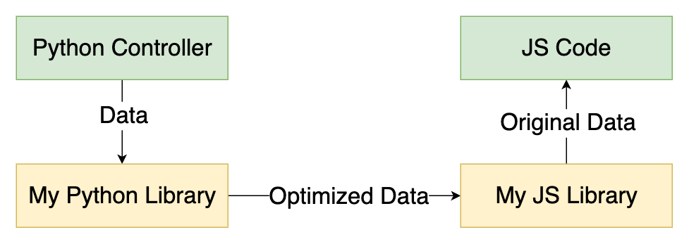

# What the Project is About
We usually send data from a backend to a frontend and from front end to the backend in JSON format. JSON data contains keys and values. Programmers use intention-representing names as keys which can be long. As a result, the keys take much space in JSON data. ChatGPT estimated that the keys in JSON data takes around 20 to 60% of the total space on an average.

Since JSON data is sent back and forth between a backend and frontend, it consumes network bandwidth. Since keys take much space, they consume much network bandwidth. 

My observation is that we can completely get rid of those overheads. 

# Result
Since the libraries completely get rid of keys which take up to 60% space in JSON data on an average, the libraries can reduce JSON data by up to 60% on an average. 

# Design
Programmers can write program using dictionaries, objects - the way they usually do, as if nothing happened. The Python library gets rid of the field names before sending it to the frontend. The JS library restores the original data and sends it to the JS code as objects. 

Check out the test files inside each library for examples. 

# Implementation
I followed Strategy design pattern. The reason is that the minimization and restoration logic are different based on types. So, for handling each type, I have created a separate class. Such a class is the single source of truth for a particular type of data.   